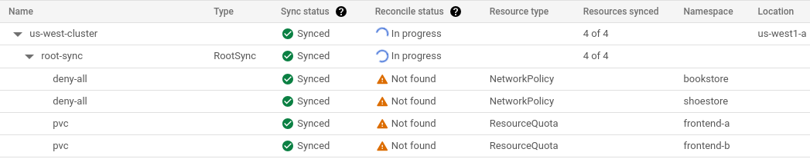
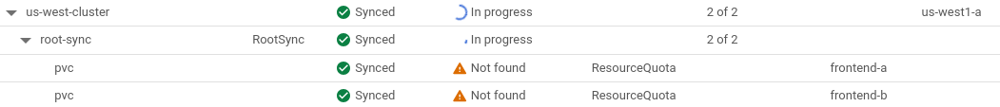
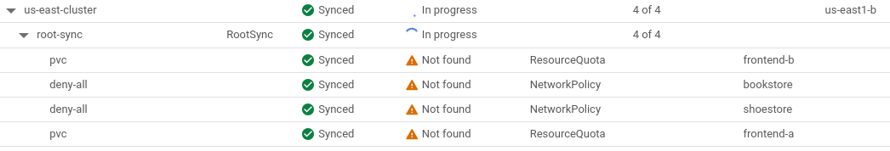
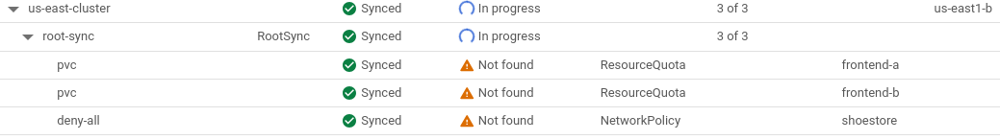

# Configure Fleet Tenancy Resources with Config Sync

[Fleet team management] provides a way to configure Namespaces and RBAC
resources at the scope level.
[Config Sync] extends this capability, allowing for the configuration of
additional namespace-scoped resources at the scope level.

Here is an example of a Fleet with two scopes: `backend` and `frontend`.

The `backend` scope includes two memberships: `us-east-cluster` and
`us-west-cluster`, while the `frontend` scope includes three memberships:
`us-east-cluster`, `us-west-cluster` and `us-central-cluster`.

The `backend` scope is associated with two Namespaces: `bookstore` and
`shoestore`, while the `frontend` scope is linked to two Fleet Namespaces:
`frontend-a` and `frontend-b`.

To apply a NetworkPolicy to all Namespaces bound to the `backend` scope,
and a ResourceQuota to all Namespaces bound to the `frontend` scope, the Fleet
management team can configure a source of truth with additional resources, for
example: [fleet-tenancy/config](config).


## Prerequisite

1. Terraform CLI is installed as this user guide leverages Terraform to
   configure resources.
2. The source of truth is created. If not, use the public [example](config)
   as a quickstart.
3. A fleet host project already exists.
4. Use ACM version 1.17.0 or later.

## 1. [Set up your fleet]

This step includes the following operations:
- Create a Fleet in a project
- Enable API services
- Create a service account and grant the service account a list of IAM roles.

Terraform configs: [link](terraform/1-fleet).

Apply the resources via Terraform: [README.md](terraform/1-fleet/README.md).

Notes:
- You may need to run this command multiple times to get all resources created
  successfully due to internal dependencies.
- After the step, you need to create and download the service account’s private
  key JSON file.

## 2. Configure Fleet Default Member Config ConfigManagement

This step configures the Fleet Default Member Config ConfigManagement.

Terraform configs: [link](terraform/2-fleet-default-config).

Apply the resources via Terraform: [README.md](terraform/2-fleet-default-config/README.md).

Notes:
- The Fleet Default Member Config must be created before clusters are registered 
  to the fleet. The default config won’t apply to previously registered clusters.

## 3. Create and register clusters

This step creates and registers clusters. For simplicity, we use GKE clusters
and register them for the same project as the fleet.

Terraform configs: [link](terraform/3-clusters).

Apply the resources via Terraform: [README.md](terraform/3-clusters/README.md).

## 4. Configure Fleet Scopes and Namespaces

This step includes the following operations:
- Create team scopes: `backend` and `frontend`
- Add clusters to scopes
- Create fleet Namespaces

Terraform configs: [link](terraform/4-scopes-and-namespaces).

Apply the resources via Terraform: [README.md](terraform/4-scopes-and-namespaces/README.md).

## 5. Sync more resources to the scope

All scopes share the same source of truth. If you want to sync more sources, you
can add the configurations to the source repository with the correct
NamespaceSelector annotation. Config Sync will automatically reconcile those
resources.

## 6. Remove a cluster from a scope

When a cluster is removed from a scope, resources in the scope should be pruned
from the cluster.

Example:
There are currently 4 resources reconciled on the us-west-cluster.



Removing the cluster from the backend scope:

```bash
gcloud container fleet memberships bindings delete us-west-backend \
  --membership=us-west-cluster \
  --location=us-west1 \
  --project=your-gcp-project 
```

After the change, 2 resources in the backend scope should be pruned on the
cluster. Because the cluster is still included in the frontend scope,
2 resources in the frontend scope are still managed and reconciled on the
cluster.



## 7. Delete a Namespace

When a Namespace is deleted, resources in that Namespace should be pruned from
the cluster and never be created again.

Example:
There are currently 4 resources reconciled on the us-east-cluster.



Delete the bookstore Namespaces:

```bash
gcloud container fleet scopes namespaces delete bookstore \
  --scope=backend \
  --project=your-gcp-project
```

After the change, resources in the bookstore Namespace should be pruned on the
cluster. Resources in other Namespaces should remain unchanged.



## Cleanup

- Delete Fleet Scopes and Namespaces
- Unregister and delete clusters
- Delete Fleet default member config
- Delete the service account and disable services

To clean up, you can iterate through each terraform config directory in the
reverse order and run the terraform destroy command with your GCP project and
service account key file.

[Fleet team management]: https://cloud.google.com/anthos/fleet-management/docs/team-management
[Config Sync]: https://cloud.google.com/anthos-config-management/docs/config-sync-overview
[Set up your fleet]: https://cloud.google.com/anthos/fleet-management/docs/setup-teams#set_up_your_fleet
