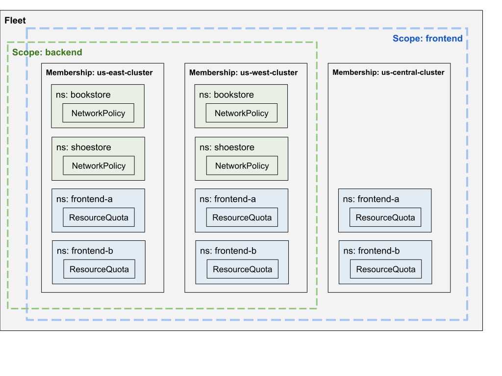
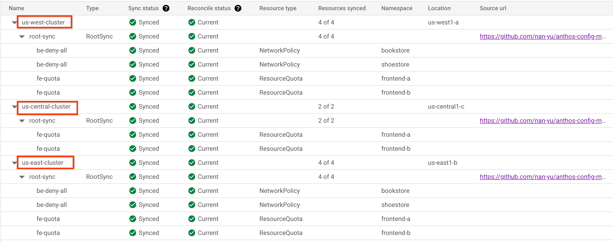

# Manage Resources of Teams and Fleet Namespaces with Config Sync

[Fleet team management] provides a way to configure Namespaces and RBAC
resources at the scope level.
[Config Sync] extends this capability, allowing for the configuration of
additional namespace-scoped resources at the scope level.

Here is an example of a Fleet with two team scopes: `backend` and `frontend`.

The `backend` scope includes two memberships: `us-east-cluster` and
`us-west-cluster`, while the `frontend` scope includes three memberships:
`us-east-cluster`, `us-west-cluster` and `us-central-cluster`.

The `backend` scope is associated with two Namespaces: `bookstore` and
`shoestore`, while the `frontend` scope is linked to two Fleet Namespaces:
`frontend-a` and `frontend-b`.

To apply a NetworkPolicy to all Namespaces bound to the `backend` scope,
and a ResourceQuota to all Namespaces bound to the `frontend` scope, the Fleet
management team can configure a source of truth with additional resources, for
example: [fleet-tenancy/config](config).



## Prerequisite

1. Terraform CLI is installed as this user guide leverages Terraform to
   configure resources.
2. The source of truth is created. If not, use the public [example](config)
   as a quickstart.
3. Create or select a Google Cloud project.
4. Required roles are:
   * Managing fleet resources: Fleet Admin (formerly GKE Hub Admin)
     (`roles/gkehub.admin`)
   * Creating GKE clusters: Kubernetes Engine Cluster Admin
     (`roles/container.clusterAdmin`)
   * Enabling GKE Enterprise: Service Usage Admin
     (`roles/serviceusage.serviceUsageAdmin`)
5. To run the Terraform commands in this guide in your local environment, run
   the following command to acquire new user credentials:
   ```shell
   gcloud auth application-default login
   ```

## 1. [Set up your fleet]

This step includes the following operations:
- Create a Fleet in a project
- Enable API services

Terraform configs: [link](terraform/1-fleet).

Apply the resources via Terraform: [README.md](terraform/1-fleet/README.md).

## 2. Configure fleet-level defaults for Config Sync

This step configures fleet-level defaults to install Config Sync on entire
fleet, which syncs Kubernetes manifests from the [source repository](config)
to all clusters in the fleet.

The source repository includes the following:
- Three `NamespaceSelector` objects with the [dynamic mode], one for the `frontend`
  team scope, and the other two for the `backend` team scope. In the dynamic
  mode, `NamespaceSelector` selects both statically-declared Namespaces and those
  dynamically present on the clusters with matching labels. For more details,
  see [Limit which namespaces a config affects].
- One `ResourceQuota` object that is synced to all [fleet namespaces] of the
  team scope `frontend`.
- One `NetworkPolicy` object that is synced to all fleet namespaces of the team
  scope `backend`.
- One [`RepoSync`](https://cloud.google.com/anthos-config-management/docs/reference/rootsync-reposync-fields)
  and `RoleBinding` objects that are synced to the `bookstore` fleet namespace of
  the team scope `backend`. `RepoSync` is used to delegate resource management
  within a specific namespace. This `RepoSync` syncs Kubernetes manifests from
  the [backend team's source repository](teams/backend/bookstore).

Terraform configs: [link](terraform/2-fleet-default-config).

Apply the resources via Terraform: [README.md](terraform/2-fleet-default-config/README.md).

Note: You should create the fleet-level default configuration before creating any
additional clusters. These settings are only automatically applied to new
clusters created in the fleet, not existing clusters.

## 3. Create and register clusters

This step creates and registers clusters. For simplicity, we use GKE clusters
and register them for the same project as the fleet.

Terraform configs: [link](terraform/3-clusters).

Apply the resources via Terraform: [README.md](terraform/3-clusters/README.md).

## 4. Configure Fleet Scopes and Namespaces

This step includes the following operations:
- Create team scopes: `backend` and `frontend`
- Add clusters to scopes
- Create fleet Namespaces

Terraform configs: [link](terraform/4-scopes-and-namespaces).

Apply the resources via Terraform: [README.md](terraform/4-scopes-and-namespaces/README.md).

After fleet scopes and Namespaces are created, Config Sync automatically detects
new Namespaces with the associated scope, selects resources in the fleet
Namespaces and reconciles them.

So far, the `NetworkPolicy` object should be applied to all Namespaces bound to
the `backend` scope, and the `ResourceQuota` object should be applied to all
Namespaces bound to the `frontend` scope.



All scopes share the same source of truth. If you want to sync more sources, you
can add configurations to the source repository with the correct
NamespaceSelector annotation. Config Sync will automatically reconcile those
resources.

Fleet resources are dynamically synced to fleet Namespaces in team scopes.
- When a cluster is removed from a scope, resources in the scope should be
  pruned from the cluster.
- When a fleet Namespace is deleted, resources in that Namespace should be
  pruned from the cluster.

## Cleanup

- Delete Fleet Scopes and Namespaces
- Unregister and delete clusters
- Delete Fleet default member config
- Disable services

To clean up, you can iterate through each terraform config directory in the
reverse order and run the `terraform destroy` command with your GCP project.

[Fleet team management]: https://cloud.google.com/anthos/fleet-management/docs/team-management
[Config Sync]: https://cloud.google.com/anthos-config-management/docs/config-sync-overview
[Set up your fleet]: https://cloud.google.com/anthos/fleet-management/docs/setup-teams#set_up_your_fleet
[dynamic mode]: https://cloud.google.com/anthos-config-management/docs/how-to/namespace-scoped-objects#namespaceselector_mode
[Limit which namespaces a config affects]: https://cloud.google.com/anthos-config-management/docs/how-to/namespace-scoped-objects#namespaceselectors
[fleet namespaces]: https://cloud.google.com/anthos/fleet-management/docs/team-management#fleet_team_management_overview
