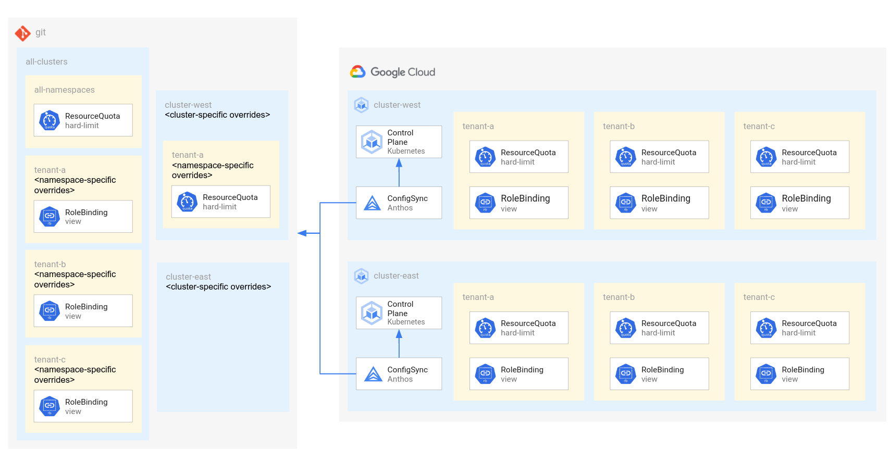

# Multi-Cluster Access and Quota

This tutorial shows how to manage Namespaces, RoleBindings, and ResourceQuotas across multiple clusters using Anthos Config Management, GitOps, and Kustomize.

The resources in this tutorial are different for each cluster. So ConfigSync is configured to pull config from different directories. If you want your config to be identical for every cluster, check out the [Multi-Cluster Fan-out](../multi-cluster-fan-out/) tutorial instead.



## Namespace management

In this tutorial, each cluster includes the same namespaces. This is not strictly required, but makes it easier to manage a set of clusters.

The namespaces are managed in `configsync-src/all-clusters/namespaces.yaml` and inherited using a `kustomization.yaml` file for each cluster.

## Access control

In this tutorial, each namespace includes a RoleBindings to grant view permission to namespace users.

Following the pattern of [namespace sameness](https://cloud.google.com/anthos/multicluster-management/environs#namespace_sameness), the users are configured to be different for each namespace, but the same across clusters.

The RoleBindings are managed in `configsync-src/all-clusters/namespaces/${namespace}/rbac.yaml` and inherited using a `kustomization.yaml` file for each namespace in each cluster.

## Quota management

In this tutorial, each namespace includes a default ResourceQuota with a maximum set for CPU, memory, and pods.

This default resource is managed in `configsync-src/all-clusters/all-namespaces/resource-quota.yaml` and inherited using a `kustomization.yaml` file for each namespace in each cluster.

There is also one example of the default quota being overridden for a specific namespace on a specific cluster, in `configsync-src/clusters/cluster-east/namespaces/tenant-a/resource-quota.yaml`.

## Clusters

- **cluster-east** - A multi-zone GKE cluster in the us-east1 region.
- **cluster-west** - A multi-zone GKE cluster in the us-west1 region.

## Filesystem Hierarchy

**Platform Repo (`repos/platform/`):**

```
├── configsync
│   └── clusters
│       ├── cluster-east
│       │   ├── namespaces
│       │   │   ├── tenant-a
│       │   │   │   ├── rbac.authorization.k8s.io_v1_rolebinding_namespace-viewer.yaml
│       │   │   │   └── v1_resourcequota_hard-limit.yaml
│       │   │   ├── tenant-b
│       │   │   │   ├── rbac.authorization.k8s.io_v1_rolebinding_namespace-viewer.yaml
│       │   │   │   └── v1_resourcequota_hard-limit.yaml
│       │   │   └── tenant-c
│       │   │       ├── rbac.authorization.k8s.io_v1_rolebinding_namespace-viewer.yaml
│       │   │       └── v1_resourcequota_hard-limit.yaml
│       │   ├── v1_namespace_tenant-a.yaml
│       │   ├── v1_namespace_tenant-b.yaml
│       │   └── v1_namespace_tenant-c.yaml
│       └── cluster-west
│           ├── namespaces
│           │   ├── tenant-a
│           │   │   ├── rbac.authorization.k8s.io_v1_rolebinding_namespace-viewer.yaml
│           │   │   └── v1_resourcequota_hard-limit.yaml
│           │   ├── tenant-b
│           │   │   ├── rbac.authorization.k8s.io_v1_rolebinding_namespace-viewer.yaml
│           │   │   └── v1_resourcequota_hard-limit.yaml
│           │   └── tenant-c
│           │       ├── rbac.authorization.k8s.io_v1_rolebinding_namespace-viewer.yaml
│           │       └── v1_resourcequota_hard-limit.yaml
│           ├── v1_namespace_tenant-a.yaml
│           ├── v1_namespace_tenant-b.yaml
│           └── v1_namespace_tenant-c.yaml
├── configsync-src
│   ├── all-clusters
│   │   ├── all-namespaces
│   │   │   ├── kustomization.yaml
│   │   │   └── resource-quota.yaml
│   │   ├── kustomization.yaml
│   │   ├── namespaces
│   │   │   ├── tenant-a
│   │   │   │   ├── kustomization.yaml
│   │   │   │   └── rbac.yaml
│   │   │   ├── tenant-b
│   │   │   │   ├── kustomization.yaml
│   │   │   │   └── rbac.yaml
│   │   │   └── tenant-c
│   │   │       ├── kustomization.yaml
│   │   │       └── rbac.yaml
│   │   └── namespaces.yaml
│   └── clusters
│       ├── cluster-east
│       │   ├── kustomization.yaml
│       │   └── namespaces
│       │       ├── tenant-a
│       │       │   ├── kustomization.yaml
│       │       │   └── resource-quota.yaml
│       │       ├── tenant-b
│       │       │   └── kustomization.yaml
│       │       └── tenant-c
│       │           └── kustomization.yaml
│       └── cluster-west
│           ├── kustomization.yaml
│           └── namespaces
│               ├── tenant-a
│               │   └── kustomization.yaml
│               ├── tenant-b
│               │   └── kustomization.yaml
│               └── tenant-c
│                   └── kustomization.yaml
└── scripts
    └── render.sh
```

## Kustomize

In this tutorial, some resources differ between namespaces and clusters.

Because of this, the resources specific to each cluster and the same on each cluster are managed in different places and merged together using Kustomize. Likewise, the resources specific to each namespace and the same in each namespace are managed in different places and merged together using Kustomize. This is not strictly required, but it may help reduce the risk of misconfiguration between clusters and make it easier to roll out changes consistently.

Kustomize is also being used here to add additional labels, to aid observability.

To invoke Kustomize, execute `scripts/render.sh` to render the resources under `configsync-src/` and write them to `configsync/`.

If you don't want to use Kustomize, just use the resources under the `configsync/` directory and delete the `configsync-src/` and `scripts/render.sh` script.

## ConfigSync

This tutorial installs ConfigSync on two clusters and configures them to pull config from different `configsync/clusters/${cluster-name}/` directories in the same Git repository.

## Progressive rollouts

This tutorial demonstrates the deployment of resources to multiple clusters at the same time. In a production environment, you may want to reduce the risk of rolling out changes by deploying to each cluster individually and/or by deploying to a staging environment first.

One way to do that is to change the field `spec.git.revision` in the [RootSync](https://cloud.google.com/kubernetes-engine/docs/add-on/config-sync/how-to/multi-repo#root-sync) resource for each cluster to point to a specific commit SHA or tag. That way, both clusters will pull from a specific revision, instead of both pulling from `HEAD` of the `main` branch. This method may help protect against complete outage and allow for easy rollbacks, at the cost of a few more commits per rollout.

To read more about progressive delivery patterns, see [Safe rollouts with Anthos Config Management](https://cloud.google.com/architecture/safe-rollouts-with-anthos-config-management).

## Before you begin

1. Follow the [Multi-Cluster Anthos Config Management Setup](./multi-cluster-acm-setup/) tutorial to deploy two GKE clusters and install ACM.

## Create a Git repository for platform config

[Github: Create a repo](https://docs.github.com/en/github/getting-started-with-github/create-a-repo)

```
PLATFORM_REPO="https://github.com/USER_NAME/REPO_NAME/"
```

**Select or create a local workspace directory:**

Since you will need to clone multiple repos for this tutorial, select a directory to contain them.

- Replace `<WORKSPACE>` with the name of the desired workspace directory (ex: `~/workspace`)

This value will be stored in an environment variable for later use.

```
WORKSPACE="<WORKSPACE>"

mkdir -p "${WORKSPACE}"
```

**Clone the tutorial repo:**

```
cd "${WORKSPACE}"

git clone https://github.com/GoogleCloudPlatform/anthos-config-management-samples.git
```

**Clone the platform repo:**

```
cd "${WORKSPACE}"

git clone "${PLATFORM_REPO}" platform
```

**Copy the platform config from the tutorial repo:**

```
cd "${WORKSPACE}"

cp -r anthos-config-management-samples/multi-cluster-fan-out/repos/platform/* platform/
```

**Push the platform config to the platform repo:**

```
cd "${WORKSPACE}/platform/"

git add .

git commit -m "initialize platform config"

git push
```

## Configure Anthos Config Management for platform config

[Anthos Config Management (ACM)](https://cloud.google.com/anthos-config-management/docs/overview) is used to install ConfigSync. ConfigSync can then be configured using the `RootSync` and `RepoSync` resources.

`RootSync` can be used to manage any cluster resource, including both cluster-scoped and namespace-scoped resources. Only on `RootSync` is allowed per cluster.

`RepoSync` can be used to manage resources in a single namespace. ConfigSync supports one `RepoSync` per namespace.

**Configure ACM using kubectl (recommended):**

If you installed ACM using kubectl, you must also configure `ConfigManagement` using kubectl.

```
kubectl apply --context ${CLUSTER_WEST_CONTEXT} -f - << EOF
apiVersion: configmanagement.gke.io/v1
kind: ConfigManagement
metadata:
  name: config-management
spec:
  clusterName: cluster-west
  enableMultiRepo: true
EOF

kubectl apply --context ${CLUSTER_EAST_CONTEXT} -f - << EOF
apiVersion: configmanagement.gke.io/v1
kind: ConfigManagement
metadata:
  name: config-management
spec:
  clusterName: cluster-east
  enableMultiRepo: true
EOF
```

**Wait for the RootSync CRD to be created:**

The ACM installer also installs the RootSync Custom Resource Definition (CRD).
The next apply command will fail if the RootSync CRD is not available yet.
This process should only take a few seconds.

**Configure RootSync using kubectl (recommended):**

If you installed ACM using kubectl, you must also configure `RootSync` using kubectl.

```
kubectl apply --context ${CLUSTER_WEST_CONTEXT} -f - << EOF
apiVersion: configsync.gke.io/v1beta1
kind: RootSync
metadata:
  name: root-sync
  namespace: config-management-system
spec:
  sourceFormat: unstructured
  git:
    repo: ${PLATFORM_REPO}
    branch: main
    revision: HEAD
    dir: "configsync/clusters/cluster-west"
    auth: none
EOF

kubectl apply --context ${CLUSTER_EAST_CONTEXT} -f - << EOF
apiVersion: configsync.gke.io/v1beta1
kind: RootSync
metadata:
  name: root-sync
  namespace: config-management-system
spec:
  sourceFormat: unstructured
  git:
    repo: ${PLATFORM_REPO}
    branch: main
    revision: HEAD
    dir: "configsync/clusters/cluster-east"
    auth: none
EOF
```

**Configure ACM and RootSync using Hub:**

If you installed ACM using Hub, you must also configure `ConfigManagement` using Hub.

When using Hub to manage ACM configuration, the `RootSync` resource will automatically be generated using the legacy configuration syntax in the `ConfigManagement` resource.

```
cat > config-management-west.yaml << EOF
apiVersion: configmanagement.gke.io/v1
kind: ConfigManagement
metadata:
  name: config-management
spec:
  sourceFormat: unstructured
  git:
    syncRepo: ${PLATFORM_REPO}
    syncBranch: main
    syncRev: HEAD
    policyDir: "configsync/clusters/cluster-west"
    secretType: none
EOF

gcloud alpha container hub config-management apply \
  --membership "cluster-west" \
  --config config-management-west.yaml

cat > config-management-east.yaml << EOF
apiVersion: configmanagement.gke.io/v1
kind: ConfigManagement
metadata:
  name: config-management
spec:
  sourceFormat: unstructured
  git:
    syncRepo: ${PLATFORM_REPO}
    syncBranch: main
    syncRev: HEAD
    policyDir: "configsync/clusters/cluster-east"
    secretType: none
EOF

gcloud alpha container hub config-management apply \
  --membership "cluster-east" \
  --config config-management-east.yaml
```

## Validating success

**Lookup latest commit SHA:**

```
(cd "${WORKSPACE}/platform/" && git log -1 --oneline)
```

**Wait for config to be deployed:**

```
nomos status --contexts ${CLUSTER_WEST_CONTEXT},${CLUSTER_EAST_CONTEXT}
```

Should say "SYNCED" for both clusters with the latest commit SHA.

**Verify expected namespaces exist:**

```
kubectl get ns --context ${CLUSTER_WEST_CONTEXT}

kubectl get ns --context ${CLUSTER_EAST_CONTEXT}
```

Should include (non-exclusive):
- tenant-a
- tenant-b
- tenant-c

**Verify expected resource exist:**

```
kubectl config use-context ${CLUSTER_WEST_CONTEXT}
kubectl get ResourceQuota,RoleBinding -n tenant-a
kubectl get ResourceQuota,RoleBinding -n tenant-b
kubectl get ResourceQuota,RoleBinding -n tenant-c


kubectl config use-context ${CLUSTER_EAST_CONTEXT}
kubectl get ResourceQuota,RoleBinding -n tenant-a
kubectl get ResourceQuota,RoleBinding -n tenant-b
kubectl get ResourceQuota,RoleBinding -n tenant-c
```

Should include (non-exclusive):
- resourcequota/hard-limit
- rolebinding.rbac.authorization.k8s.io/namespace-viewer

## Cleaning up

If you plan to follow more multi-cluster tutorials, you can clean up these clusters with the following steps. Otherwise, follow the Clean up instructions on the [Setup](../multi-cluster-acm-setup/) tutorial to delete the clusters, network, and project.

**Delete the platform config in the platform repo:**

```
cd "${WORKSPACE}/platform/"

rm -rf ./*

git add .

git commit -m "delete platform config"

git push
```

**Lookup latest commit SHA:**

```
git log -1 --oneline
```

**Wait for config to be synchronized:**

```
nomos status --contexts ${CLUSTER_WEST_CONTEXT},${CLUSTER_EAST_CONTEXT}
```

Should say "SYNCED" for both clusters with the latest commit SHA.

**Delete the ACM resources with kubectl (recommended):**

If you installed ACM with kubectl, the `RootSync` and `ConfigManagement` resources must also be deleted with kubectl.

```
kubectl delete RootSync,ConfigManagement --all --context ${CLUSTER_WEST_CONTEXT}
kubectl delete RootSync,ConfigManagement --all --context ${CLUSTER_EAST_CONTEXT}
```

**Delete the ACM resources with Hub:**

If you installed ACM with Hub, the `RootSync` and `ConfigManagement` resources must also be deleted with Hub.

```
gcloud alpha container hub config-management delete --membership "cluster-west"
gcloud alpha container hub config-management delete --membership "cluster-east"
```

**Delete the platform repo:**

[Github: Deleting a repository](https://docs.github.com/en/github/creating-cloning-and-archiving-repositories/archiving-a-github-repository)

```
rm -rf "${WORKSPACE}/platform/"
```

## Next steps

- To learn how to manage tenant resources across clusters, follow the [Multi-Cluster Ingress](../multi-cluster-ingress/) tutorial.
