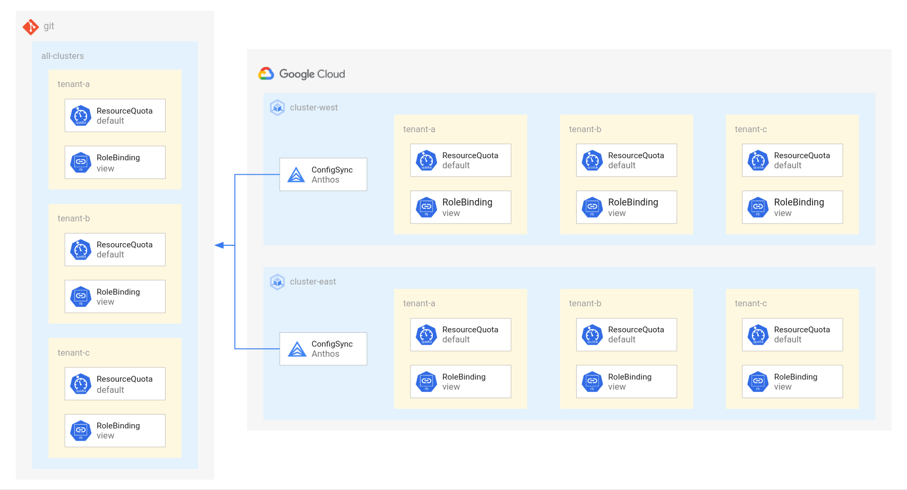

# Multi-Cluster Fan-out

This tutorial shows how to manage Namespaces, RoleBindings, and ResourceQuotas across multiple clusters using Anthos Config Management and GitOps.

The resources in this tutorial are identical across both clusters. So Config Sync is configured to pull config from the same directory. If you want your config to be different for every cluster, check out the [Multi-Cluster Access and Quota](../multi-cluster-access-and-quota/) tutorial instead.



## Clusters

- **cluster-east** - A multi-zone GKE cluster in the us-east1 region.
- **cluster-west** - A multi-zone GKE cluster in the us-west1 region.

## Filesystem Hierarchy

**Platform Repo (`repos/platform/`):**

```
└── configsync
    └── all-clusters
        ├── namespaces
        │   ├── tenant-a
        │   │   ├── quota.yaml
        │   │   └── rbac.yaml
        │   ├── tenant-b
        │   │   ├── quota.yaml
        │   │   └── rbac.yaml
        │   └── tenant-c
        │       ├── quota.yaml
        │       └── rbac.yaml
        └── namespaces.yaml
```

## Access Control

This tutorial includes RoleBindings in each namespace to grant view permission to namespace users.

The users are configured to be different for each namespace, but the same across clusters.

## Progressive rollouts

This tutorial demonstrates the deployment of resources to multiple clusters at the same time. In a production environment, you may want to reduce the risk of rolling out changes by deploying to each cluster individually and/or by deploying to a staging environment first.

One way to do that is to change the field `spec.git.revision` in the [RootSync](https://cloud.google.com/kubernetes-engine/docs/add-on/config-sync/how-to/multi-repo#root-sync) resource for each cluster to point to a specific commit SHA or tag. That way, both clusters will pull from a specific revision, instead of both pulling from `HEAD` of the `main` branch. This method may help protect against complete outage and allow for easy rollbacks, at the cost of a few more commits per rollout.

Another option is to separate the configuration for each cluster into different directories. See [Multi-Cluster Resource Management](../multi-cluster-resource-management) for an example of this pattern.

To read more about progressive delivery patterns, see [Safe rollouts with Anthos Config Management](https://cloud.google.com/architecture/safe-rollouts-with-anthos-config-management).

## Config Sync

This tutorial installs Config Sync on two clusters and configures them both to pull config from the same `configsync/all-clusters/` directory in the same Git repository.

## Before you begin

1. Follow the [Multi-Cluster Anthos Config Management Setup](./multi-cluster-acm-setup/) tutorial to deploy two GKE clusters and install ACM.

## Create a Git repository for platform config

[Github: Create a repo](https://docs.github.com/en/github/getting-started-with-github/create-a-repo)

```
PLATFORM_REPO_HTTPS="https://github.com/USER_NAME/REPO_NAME/"
PLATFORM_REPO_SSH="git@github.com:USER_NAME/REPO_NAME.git"
```

**Select or create a local workspace directory:**

Since you will need to clone multiple repos for this tutorial, select a directory to contain them.

- Replace `<WORKSPACE>` with the name of the desired workspace directory (ex: `~/workspace`)

This value will be stored in an environment variable for later use.

```
WORKSPACE="<WORKSPACE>"

mkdir -p "${WORKSPACE}"
```

**Clone the tutorial repo:**

```
cd "${WORKSPACE}"

git clone https://github.com/GoogleCloudPlatform/anthos-config-management-samples.git
```

**Clone the platform repo:**

```
cd "${WORKSPACE}"

git clone "${PLATFORM_REPO_SSH}" platform
```

**Copy the platform config from the tutorial repo:**

```
cd "${WORKSPACE}"

cp -r anthos-config-management-samples/multi-cluster-fan-out/repos/platform/* platform/
```

**Push the platform config to the platform repo:**

```
cd "${WORKSPACE}/platform/"

git add .

git commit -m "initialize platform config"

git push
```

## Configure Config Sync

[Anthos Config Management (ACM)](https://cloud.google.com/anthos-config-management/docs/overview) is used to install and configure Config Sync.

[Hub](https://cloud.google.com/sdk/gcloud/reference/container/hub) is used to install and configure ACM.

**Configure Config Sync using Hub:**

```
cat > config-management.yaml << EOF
applySpecVersion: 1
spec:
  configSync:
    enabled: true
    sourceFormat: unstructured
    syncRepo: ${PLATFORM_REPO_HTTPS}
    syncBranch: main
    syncRev: HEAD
    policyDir: "configsync/all-clusters"
    secretType: none
EOF

gcloud beta container fleet config-management apply \
  --membership "cluster-west" \
  --config config-management.yaml

gcloud beta container fleet config-management apply \
  --membership "cluster-east" \
  --config config-management.yaml

rm config-management.yaml
```

This triggers the following actions:
1. Hub installs the ACM Operator
1. Hub configures the ACM Operator using a `ConfigManagement` resource
1. ACM Operator installs ConfigSync
1. Hub configures ConfigSync using a `RootSync` resources

## Validating success

**Lookup latest commit SHA:**

```
(cd "${WORKSPACE}/platform/" && git rev-parse --short HEAD)
```

**Lookup the Config Sync status:**

```
gcloud beta container fleet config-management status
```

Should say "SYNCED" for both clusters with the latest commit SHA.

If not yet SYNCED, you may need to wait and retry.

**Alternatively, use the `nomos` tool:**

```
nomos status --contexts ${CLUSTER_WEST_CONTEXT},${CLUSTER_EAST_CONTEXT}
```

Should say "SYNCED" for both clusters with the latest commit SHA.

If not yet SYNCED, you may need to wait and retry.

**Verify expected namespaces exist:**

```
kubectl get ns --context ${CLUSTER_WEST_CONTEXT}
kubectl get ns --context ${CLUSTER_EAST_CONTEXT}
```

Should include (non-exclusive):
- tenant-a
- tenant-b
- tenant-c

**Verify expected resource exist:**

```
kubectl config use-context ${CLUSTER_WEST_CONTEXT}
kubectl get ResourceQuota,RoleBinding -n tenant-a
kubectl get ResourceQuota,RoleBinding -n tenant-b
kubectl get ResourceQuota,RoleBinding -n tenant-c


kubectl config use-context ${CLUSTER_EAST_CONTEXT}
kubectl get ResourceQuota,RoleBinding -n tenant-a
kubectl get ResourceQuota,RoleBinding -n tenant-b
kubectl get ResourceQuota,RoleBinding -n tenant-c
```

Should include (non-exclusive):
- resourcequota/hard-limit
- rolebinding.rbac.authorization.k8s.io/namespace-viewer

## Cleaning up

If you plan to follow more multi-cluster tutorials, you can clean up these clusters with the following steps. Otherwise, follow the Clean up instructions on the [Setup](../multi-cluster-acm-setup/) tutorial to delete the clusters, network, and project.

**Delete the platform config in the platform repo:**

Config Sync prevents you from deleting all resources at once (to prevent accidental deletions). Instead, you will need to teardown your resources in a few steps.

First, delete everything and add a new unused namespace as a tombstone:

```
cd "${WORKSPACE}/platform/"
rm -rf ./configsync/all-clusters/*

cat > ./configsync/all-clusters/tombstone.yaml <<EOF
apiVersion: v1
kind: Namespace
metadata:
  name: tombstone
EOF

git add .
git commit -m "delete platform config & replace with tombstone"
git push
```

Then, delete the tombstone and leave an empty invisible file to keep the directory in git:

```
cd "${WORKSPACE}/platform/"
rm -rf ./configsync/all-clusters/*

touch ./configsync/all-clusters/.gitignore

git add .
git commit -m "delete tombstone namespace"
git push
```

**Lookup latest commit SHA:**

```
(cd "${WORKSPACE}/platform/" && git rev-parse --short HEAD)
```

**Wait for config to be synchronized:**

```
gcloud beta container fleet config-management status
```

Should say "SYNCED" for both clusters with the latest commit SHA.

If not yet SYNCED, you may need to wait and retry.

**Disable Config Sync with Hub:**

```
cat > config-management.yaml << EOF
applySpecVersion: 1
spec:
  configSync:
    enabled: false
EOF

gcloud beta container fleet config-management apply \
  --membership "cluster-west" \
  --config config-management.yaml

gcloud beta container fleet config-management apply \
  --membership "cluster-east" \
  --config config-management.yaml

rm config-management.yaml
```

**Delete the platform repo:**

[Github: Deleting a repository](https://docs.github.com/en/github/creating-cloning-and-archiving-repositories/archiving-a-github-repository)

```
cd "${WORKSPACE}/"
rm -rf "${WORKSPACE}/platform/"
```

## Next steps

- To learn how to manage resources separately for each cluster, follow the [Multi-Cluster Access and Quota](../multi-cluster-access-and-quota/) tutorial.
