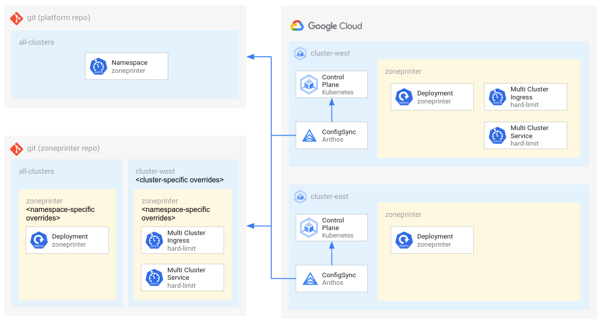

# Multi-Cluster Ingress

This tutorial shows how to manage an application with Multi-Cluster Ingress using Anthos Config Management, GitOps, and Kustomize.

This tutorial is based on [Deploying Ingress across clusters](https://cloud.google.com/kubernetes-engine/docs/how-to/multi-cluster-ingress), except it uses Config Sync and kustomize to deploy to multiple multi-tenant clusters.

In addition, this tutorial shows how to use the Kustomize configuration from [Multi-Cluster Access and Quota](../multi-cluster-access-and-quota/) to manage cluster resources seperately from namespace resources, which is useful if you have a platform team managing clusters for seperate application teams.



# Goals

This usage of Multi-Cluster Ingress serves multiple goals:

By using backends on multiple clusters in different regions, each with nodes in multiple zones, and a single global Virtual IP, the application can reach very **high availability**.

By using backends on multiple clusters in different regions and Google's global [Cloud Load Balancer](https://cloud.google.com/load-balancing/docs/load-balancing-overview), which automatically routes traffic based on latency, availability, and capacity, the application can have very **low latency** for clients in different parts of the world.

By using backends on multiple clusters, the application can reach very **high scale**, beyond that which can be supported by a single cluster.

## Clusters

- **cluster-east** - A multi-zone GKE cluster in the us-east1 region.
- **cluster-west** - A multi-zone GKE cluster in the us-west1 region.

## Tenant Workloads

This tutorial demonstrates one tenant with a workload that span multiple clusters:

- **zoneprinter** - an echo service behind Multi-Cluster Ingress

## Filesystem Hierarchy

**Platform Repo (`repos/platform/`):**

```
├── configsync
│   └── clusters
│       ├── cluster-east
│       │   └── v1_namespace_zoneprinter.yaml
│       └── cluster-west
│           └── v1_namespace_zoneprinter.yaml
├── configsync-src
│   ├── all-clusters
│   │   ├── kustomization.yaml
│   │   └── namespaces.yaml
│   └── clusters
│       ├── cluster-east
│       │   └── kustomization.yaml
│       └── cluster-west
│           └── kustomization.yaml
└── scripts
    └── render.sh
```

**ZonePrinter Repo (`repos/zoneprinter/`):**

```
├── configsync
│   └── clusters
│       ├── cluster-east
│       │   └── namespaces
│       │       └── zoneprinter
│       │           └── apps_v1_deployment_zoneprinter.yaml
│       └── cluster-west
│           └── namespaces
│               └── zoneprinter
│                   ├── apps_v1_deployment_zoneprinter.yaml
│                   ├── networking.gke.io_v1_multiclusteringress_zoneprinter.yaml
│                   └── networking.gke.io_v1_multiclusterservice_zoneprinter.yaml
├── configsync-src
│   ├── all-clusters
│   │   └── namespaces
│   │       └── zoneprinter
│   │           ├── kustomization.yaml
│   │           └── zoneprinter-deployment.yaml
│   └── clusters
│       ├── cluster-east
│       │   └── namespaces
│       │       └── zoneprinter
│       │           └── kustomization.yaml
│       └── cluster-west
│           └── namespaces
│               └── zoneprinter
│                   ├── kustomization.yaml
│                   └── mci.yaml
└── scripts
    └── render.sh
```

# Config Cluster

In this tutorial, the `cluster-west` cluster will be used as the [config cluster](https://cloud.google.com/kubernetes-engine/docs/how-to/multi-cluster-ingress-setup#specifying_a_config_cluster) for Multi-cluster Ingress. The [MultiClusterIngress](https://cloud.google.com/kubernetes-engine/docs/how-to/multi-cluster-ingress#multiclusteringress_spec) and [MultiClusterService](https://cloud.google.com/kubernetes-engine/docs/how-to/multi-cluster-ingress#multiclusterservice_spec) resources in the `mci.yaml` file are only being deployed to the `cluster-west` cluster.

In a production environment, it may be desirable to use a third cluster as the config cluster, to reduce the risk that the config cluster is unavailable to make multi-cluster changes, but in this case we're using one of the two workload clusters in order to reduce costs.

## Kustomize

In this tutorial, some resources differ between namespaces and clusters.

Because of this, the resources specific to each cluster and the same on each cluster are managed in different places and merged together using Kustomize. Likewise, the resources specific to each namespace and the same in each namespace are managed in different places and merged together using Kustomize. This is not strictly required, but it may help reduce the risk of misconfiguration between clusters and make it easier to roll out changes consistently.

Kustomize is also being used here to add additional labels, to aid observability.

To invoke Kustomize, execute `scripts/render.sh` to render the resources under `configsync-src/` and write them to `configsync/`.

If you don't want to use Kustomize, just use the resources under the `configsync/` directory and delete the `configsync-src/` and `scripts/render.sh` script.

## Config Sync

This tutorial installs Config Sync on two clusters and configures them to pull config from different `configsync/clusters/${cluster-name}/` directories in the same Git repository.

## Progressive rollouts

This tutorial demonstrates the deployment of resources to multiple clusters at the same time. In a production environment, you may want to reduce the risk of rolling out changes by deploying to each cluster individually and/or by deploying to a staging environment first.

One way to do that is to change the field `spec.git.revision` in the [RootSync](https://cloud.google.com/kubernetes-engine/docs/add-on/config-sync/how-to/multi-repo#root-sync) resource for each cluster to point to a specific commit SHA or tag. That way, both clusters will pull from a specific revision, instead of both pulling from `HEAD` of the `main` branch. This method may help protect against complete outage and allow for easy rollbacks, at the cost of a few more commits per rollout.

To read more about progressive delivery patterns, see [Safe rollouts with Anthos Config Management](https://cloud.google.com/architecture/safe-rollouts-with-anthos-config-management).

## Before you begin

1. Follow the [Multi-Cluster Anthos Config Management Setup](./multi-cluster-acm-setup/) tutorial to deploy two GKE clusters and install ACM.

## Create a Git repository for platform config

[Github: Create a repo](https://docs.github.com/en/github/getting-started-with-github/create-a-repo)

```
GITHUB_USER_NAME=<user>
GITHUB_REPO_NAME=<platform-repo>

PLATFORM_REPO_HTTPS="https://github.com/${GITHUB_USER_NAME}/${GITHUB_REPO_NAME}/"
PLATFORM_REPO_SSH="git@github.com:${GITHUB_USER_NAME}/${GITHUB_REPO_NAME}.git"
```

**Select or create a local workspace directory:**

Since you will need to clone multiple repos for this tutorial, select a directory to contain them.

- Replace `<WORKSPACE>` with the name of the desired workspace directory (ex: `~/workspace`)

This value will be stored in an environment variable for later use.

```
WORKSPACE="<WORKSPACE>"

mkdir -p "${WORKSPACE}"
```

**Clone the tutorial repo:**

```
cd "${WORKSPACE}"

git clone https://github.com/GoogleCloudPlatform/anthos-config-management-samples.git
```

**Clone the platform repo:**

```
cd "${WORKSPACE}"

git clone "${PLATFORM_REPO_SSH}" platform
```

**Copy the platform config from the tutorial repo:**

```
cd "${WORKSPACE}"

cp -r anthos-config-management-samples/multi-cluster-ingress/repos/platform/* platform/
```

**Push the platform config to the platform repo:**

```
cd "${WORKSPACE}/platform/"

git add .
git commit -m "initialize platform config"
git push
```

## Create a Git repository for ZonePrinter config

[Github: Create a repo](https://docs.github.com/en/github/getting-started-with-github/create-a-repo)

```
GITHUB_USER_NAME=<user>
GITHUB_REPO_NAME=<zoneprinter-repo>

ZONEPRINTER_REPO_HTTPS="https://github.com/${GITHUB_USER_NAME}/${GITHUB_REPO_NAME}/"
ZONEPRINTER_REPO_SSH="git@github.com:${GITHUB_USER_NAME}/${GITHUB_REPO_NAME}.git"
```

**Clone the zoneprinter repo:**

```
cd "${WORKSPACE}"

git clone "${ZONEPRINTER_REPO_SSH}" zoneprinter
```

**Copy the zoneprinter config from the tutorial repo:**

```
cd "${WORKSPACE}"

cp -r anthos-config-management-samples/multi-cluster-ingress/repos/zoneprinter/* zoneprinter/
```

**Push the zoneprinter config to the zoneprinter repo:**

```
cd "${WORKSPACE}/zoneprinter/"

git add .
git commit -m "initialize zoneprinter config"
git push
```

# Enable Multi-Cluster Ingress via Hub

```
gcloud container fleet ingress enable \
    --config-membership projects/${PLATFORM_PROJECT_ID}/locations/global/memberships/cluster-west
```

This configures cluster-west as the cluster to manage `MultiClusterIngress` and `MultiClusterService` resources for the Environ.

## Configure Config Sync for platform config

[Anthos Config Management (ACM)](https://cloud.google.com/anthos-config-management/docs/overview) is used to install and configure Config Sync.

[Hub](https://cloud.google.com/sdk/gcloud/reference/container/hub) is used to install and configure ACM.

**Configure Config Sync using Hub:**

```
cat > config-management-west.yaml << EOF
applySpecVersion: 1
spec:
  configSync:
    enabled: true
    sourceFormat: unstructured
    syncRepo: ${PLATFORM_REPO_HTTPS}
    syncBranch: main
    syncRev: HEAD
    policyDir: "configsync/clusters/cluster-west"
    secretType: none
EOF

cat > config-management-east.yaml << EOF
applySpecVersion: 1
spec:
  configSync:
    enabled: true
    sourceFormat: unstructured
    syncRepo: ${PLATFORM_REPO_HTTPS}
    syncBranch: main
    syncRev: HEAD
    policyDir: "configsync/clusters/cluster-east"
    secretType: none
EOF

gcloud beta container fleet config-management apply \
  --membership "cluster-west" \
  --config config-management-west.yaml

gcloud beta container fleet config-management apply \
  --membership "cluster-east" \
  --config config-management-east.yaml

rm config-management-west.yaml
rm config-management-east.yaml
```

This triggers the following actions:
1. Hub installs the ACM Operator
1. Hub configures the ACM Operator using a `ConfigManagement` resource
1. ACM Operator installs ConfigSync
1. Hub configures ConfigSync using a `RootSync` resources

## Configure Config Sync for zoneprinter config

To configure GitOps for the zoneprinter namespace to use a dedicated Git repo, we use the platform Git repo.

This allows for multi-tenancy in GitOps, seperating cluster-level and namespace-level configuration.

**Configure RepoSync for each cluster:**

This tells Config Sync to pull zoneprinter namespace resource config from your zoneprinter GitHub repo.

```
cd "${WORKSPACE}/platform/"

mkdir -p configsync-src/clusters/cluster-west/namespaces/zoneprinter/
mkdir -p configsync-src/clusters/cluster-east/namespaces/zoneprinter/

cat > configsync-src/clusters/cluster-west/namespaces/zoneprinter/repo-sync.yaml << EOF
apiVersion: configsync.gke.io/v1beta1
kind: RepoSync
metadata:
  name: repo-sync
  namespace: zoneprinter
spec:
  sourceFormat: unstructured
  git:
    repo: ${ZONEPRINTER_REPO_HTTPS}
    branch: main
    revision: HEAD
    dir: "configsync/clusters/cluster-west/namespaces/zoneprinter"
    auth: none
EOF

cat > configsync-src/clusters/cluster-east/namespaces/zoneprinter/repo-sync.yaml << EOF
apiVersion: configsync.gke.io/v1beta1
kind: RepoSync
metadata:
  name: repo-sync
  namespace: zoneprinter
spec:
  sourceFormat: unstructured
  git:
    repo: ${ZONEPRINTER_REPO_HTTPS}
    branch: main
    revision: HEAD
    dir: "configsync/clusters/cluster-east/namespaces/zoneprinter"
    auth: none
EOF
```

**Configure RoleBinding for all clusters:**

This grants Config Sync permission to administer the zoneprinter namespace.

```
mkdir -p configsync-src/all-clusters/namespaces/zoneprinter/

cat > configsync-src/all-clusters/namespaces/zoneprinter/configsync-rbac.yaml << EOF
kind: RoleBinding
apiVersion: rbac.authorization.k8s.io/v1
metadata:
  name: configsync-admin
  namespace: zoneprinter
subjects:
- kind: ServiceAccount
  name: ns-reconciler-zoneprinter
  namespace: config-management-system
roleRef:
  kind: ClusterRole
  name: admin
  apiGroup: rbac.authorization.k8s.io
EOF
```

**Configure kustomize to include the new files:**

```
cat > configsync-src/all-clusters/namespaces/zoneprinter/kustomization.yaml << EOF
apiVersion: kustomize.config.k8s.io/v1beta1
kind: Kustomization
resources:
- configsync-rbac.yaml
EOF

cat > configsync-src/clusters/cluster-west/namespaces/zoneprinter/kustomization.yaml << EOF
apiVersion: kustomize.config.k8s.io/v1beta1
kind: Kustomization
resources:
- ../../../../all-clusters/namespaces/zoneprinter/
- repo-sync.yaml
namespace: zoneprinter
EOF

cat > configsync-src/clusters/cluster-east/namespaces/zoneprinter/kustomization.yaml << EOF
apiVersion: kustomize.config.k8s.io/v1beta1
kind: Kustomization
resources:
- ../../../../all-clusters/namespaces/zoneprinter/
- repo-sync.yaml
namespace: zoneprinter
EOF
```

**Render the config:**

This runs kustomize on source files in `configsync-src/` and writes to `configsync/`.

```
scripts/render.sh
```

If you're not using kustomize to render config, copy the files to `configsync/` manually:

```
cp configsync-src/clusters/cluster-west/namespaces/zoneprinter/repo-sync.yaml \
  configsync/clusters/cluster-west/namespaces/zoneprinter/repo-sync.yaml
cp configsync-src/clusters/cluster-east/namespaces/zoneprinter/repo-sync.yaml \
  configsync/clusters/cluster-east/namespaces/zoneprinter/repo-sync.yaml

cp configsync-src/all-clusters/namespaces/zoneprinter/configsync-rbac.yaml \
  configsync/clusters/cluster-west/namespaces/zoneprinter/configsync-rbac.yaml
cp configsync-src/all-clusters/namespaces/zoneprinter/configsync-rbac.yaml \
  configsync/clusters/cluster-east/namespaces/zoneprinter/configsync-rbac.yaml
```

**Commit and push:**

```
git add .
git commit -m "add zoneprinter repo-sync"
git push
```

## Validating success

**Lookup latest commit SHA for the platform repo:**

```
(cd "${WORKSPACE}/platform/" && git rev-parse --short HEAD)
```

**Lookup the Config Sync status:**

```
gcloud beta container fleet config-management status
```

Should say "SYNCED" for both clusters with the latest commit SHA.

If not yet SYNCED, you may need to wait and retry.

**Lookup latest commit SHA for the zoneprinter repo:**

```
(cd "${WORKSPACE}/zoneprinter/" && git rev-parse --short HEAD)
```

**Lookup the Config Sync status with the `nomos` tool:**

```
nomos status --contexts ${CLUSTER_WEST_CONTEXT},${CLUSTER_EAST_CONTEXT}
```

Should say "SYNCED" for both clusters with the latest commit SHA.

If not yet SYNCED, you may need to wait and retry.

**Verify expected namespaces exist:**

```
kubectl get ns --context ${CLUSTER_WEST_CONTEXT}
kubectl get ns --context ${CLUSTER_EAST_CONTEXT}
```

Should include (non-exclusive):
- zoneprinter

**Verify expected resource exist:**

```
kubectl get Deployment,MultiClusterIngress,MultiClusterService -n zoneprinter --context ${CLUSTER_WEST_CONTEXT}

kubectl get Deployment -n zoneprinter --context ${CLUSTER_EAST_CONTEXT}
```

Should include (non-exclusive):
- deployment.apps/zoneprinter (both clusters)
- multiclusteringress.networking.gke.io/zoneprinter (cluster-west only)
- multiclusterservice.networking.gke.io/zoneprinter (cluster-west only)

**Poll the ingress endpoint to see which cluster responds:**

```
INGRESS_VIP=$(kubectl get MultiClusterIngress zoneprinter -n zoneprinter --context ${CLUSTER_WEST_CONTEXT} -o=custom-columns=VIP:.status.VIP --no-headers)

curl -L "http://${INGRESS_VIP}/ping"
```

Google Cloud Load Balancer uses multiple factors to decide how to route. From a single machine, you will probably get the same backend every time, as long as it's healthy and not overloaded.

```
for i in {1..100}; do curl -L "http://${INGRESS_VIP}/ping"; echo; done
```

## Cleaning up

If you plan to follow more multi-cluster tutorials, you can clean up these clusters with the following steps. Otherwise, follow the Clean up instructions on the [Setup](../multi-cluster-acm-setup/) tutorial to delete the clusters, network, and project.

**Delete the zoneprinter config in the zoneprinter repo:**

Leave an empty invisible file to keep the directory in git.

```
cd "${WORKSPACE}/zoneprinter/"

rm -rf ./configsync/*

mkdir -p ./configsync/clusters/cluster-west/namespaces/zoneprinter/
mkdir -p ./configsync/clusters/cluster-east/namespaces/zoneprinter/

touch ./configsync/clusters/cluster-west/namespaces/zoneprinter/.gitignore
touch ./configsync/clusters/cluster-east/namespaces/zoneprinter/.gitignore

git add .
git commit -m "delete zoneprinter config"
git push
```

**Lookup latest commit SHA:**

```
git rev-parse --short HEAD
```

**Wait for config to be synchronized:**

```
nomos status --contexts ${CLUSTER_WEST_CONTEXT},${CLUSTER_EAST_CONTEXT}
```

Should say "SYNCED" for both clusters with the latest commit SHA.

**Delete the platform config in the platform repo:**

Config Sync prevents you from deleting all resources at once (to prevent accidental deletions). Instead, you will need to teardown your resources in a few steps.

First, delete everything and add a new unused namespace as a tombstone:

```
cd "${WORKSPACE}/platform/"
rm -rf ./configsync/*

mkdir -p ./configsync/clusters/cluster-west/
mkdir -p ./configsync/clusters/cluster-east/

cat > ./configsync/clusters/cluster-west/tombstone.yaml <<EOF
apiVersion: v1
kind: Namespace
metadata:
  name: tombstone
EOF

cat > ./configsync/clusters/cluster-east/tombstone.yaml <<EOF
apiVersion: v1
kind: Namespace
metadata:
  name: tombstone
EOF

git add .
git commit -m "delete platform config & replace with tombstones"
git push
```

Then, delete the tombstone and leave an empty invisible file to keep the directory in git:

```
cd "${WORKSPACE}/platform/"
rm -rf ./configsync/*

mkdir -p ./configsync/clusters/cluster-west/
mkdir -p ./configsync/clusters/cluster-east/

touch ./configsync/clusters/cluster-west/.gitignore
touch ./configsync/clusters/cluster-east/.gitignore

git add .
git commit -m "delete tombstone namespace"
git push
```

**Lookup latest commit SHA:**

```
git rev-parse --short HEAD
```

**Wait for config to be synchronized:**

```
gcloud beta container fleet config-management status
```

Should say "SYNCED" for both clusters with the latest commit SHA.

If not yet SYNCED, you may need to wait and retry.

**Disable Config Sync with Hub:**

```
cat > config-management.yaml << EOF
applySpecVersion: 1
spec:
  configSync:
    enabled: false
EOF

gcloud beta container fleet config-management apply \
  --membership "cluster-west" \
  --config config-management.yaml

gcloud beta container fleet config-management apply \
  --membership "cluster-east" \
  --config config-management.yaml

rm config-management.yaml
```

**Delete the zoneprinter repo:**

[Github: Deleting a repository](https://docs.github.com/en/github/creating-cloning-and-archiving-repositories/archiving-a-github-repository)

```
cd "${WORKSPACE}/"
rm -rf "${WORKSPACE}/zoneprinter/"
```

**Delete the platform repo:**

[Github: Deleting a repository](https://docs.github.com/en/github/creating-cloning-and-archiving-repositories/archiving-a-github-repository)

```
cd "${WORKSPACE}/"
rm -rf "${WORKSPACE}/platform/"
```

**Disable Multi-Cluster Ingress via Hub:**

```
gcloud container fleet ingress disable \
    --config-membership projects/${PLATFORM_PROJECT_ID}/locations/global/memberships/cluster-west
```
